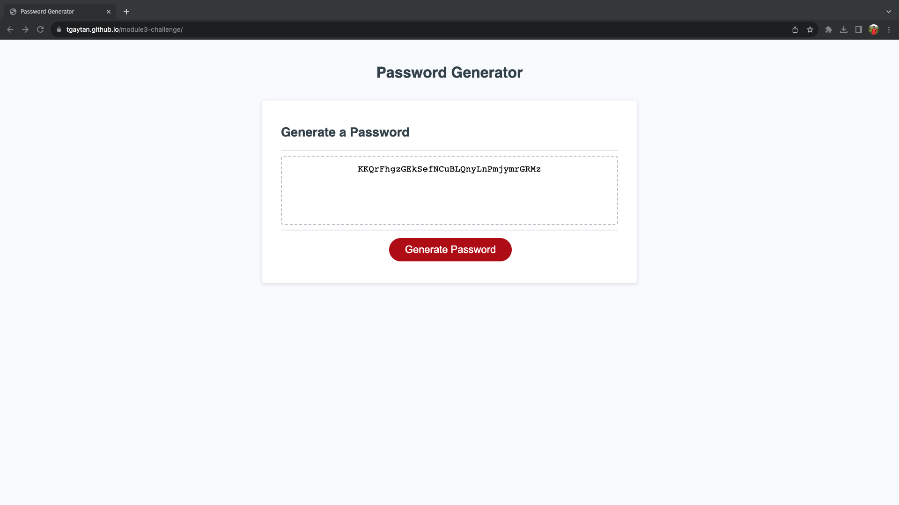

# Password Generator

## Description

This project is a password generator and it is written in JavaScript code.  The user is presented with a series of prompts to determine the password criteria and then the page will create a password that contains letters, numbers, and special characters.

I wrote this code in order to practice coding in JavaScript using loops, variables, and functions. 

## Installation

N/A

## Usage

Here is a screenshot of the web page in GitHub pages

1.  Navigate to the following URL to access the password generator site: https://tgaytan.github.io/module3-challenge/
2.  Hit the "Generate Password" button.
3.  You will be presented with the following prompts.  Answer the prompts
    *  how many characters does this password need to be? Enter an integer between 8 and 128 (8 and 128 are valide values)
    *  Select OK if you need to include lower case letters
    *  Select OK if you need to include upper case letters
    *  Select OK if you need to include numbers
    *  Select OK if you need to include special characters
4.  After the prompts have been answered, the password is displayed in the dashed box.  The password can then be copied to your clipboard.

NOTE: 
* For the first prompt in step 3, if a valid value is not provided, you will be prompted again until a valid value is provided.
* If the OK option is not selected for any prompts under step 3, you will be prompted again until "OK" is selected for at least one option.
* The following special characters are supported: " "!#$%&'()*+,-./:;<=>?@[\\]^_`{|}~".

## Credits

I used code from this page to confirm if the user gave an integer when they are prompted to input a number.
https://stackoverflow.com/questions/69355885/what-is-the-best-way-to-validate-if-a-prompt-entry-is-a-number-in-js

Source code was provided by The University of Texas at Austin online coding boot camp.  The code is included in this repo in the directory named friendly-parakeet-main.

## License

N/A
